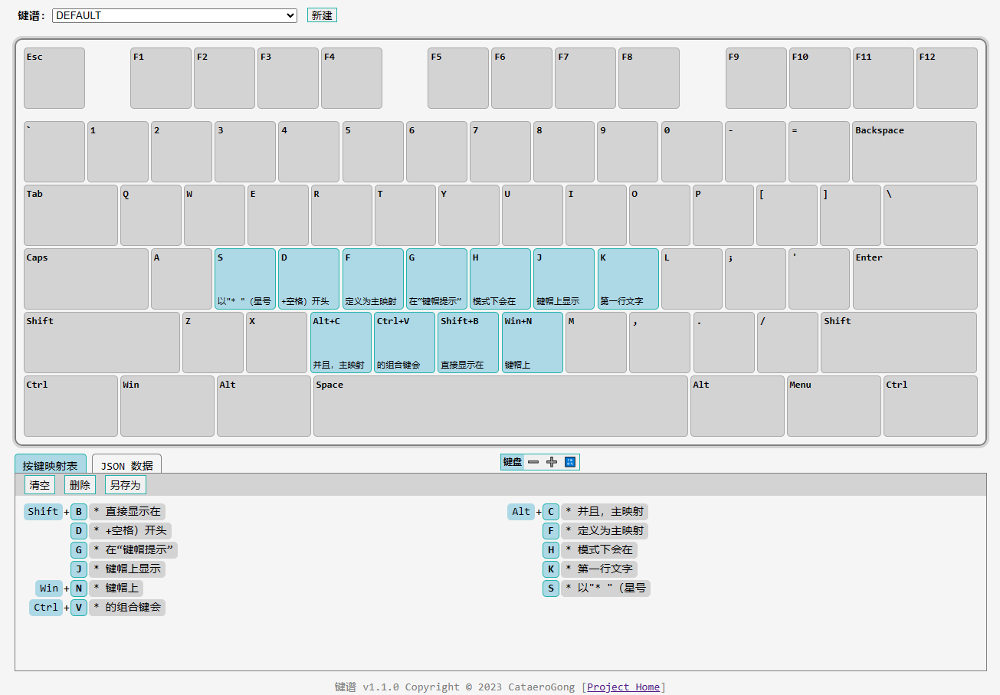
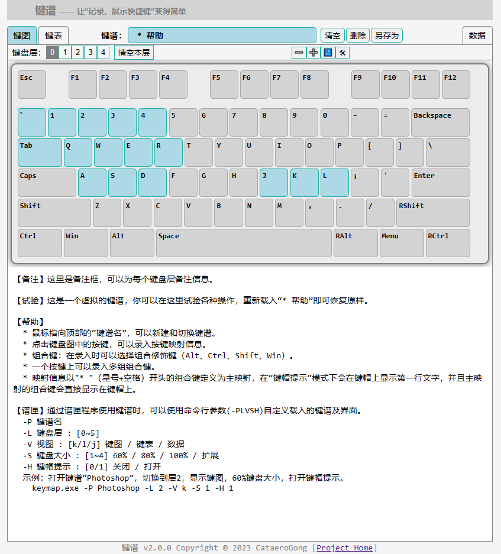
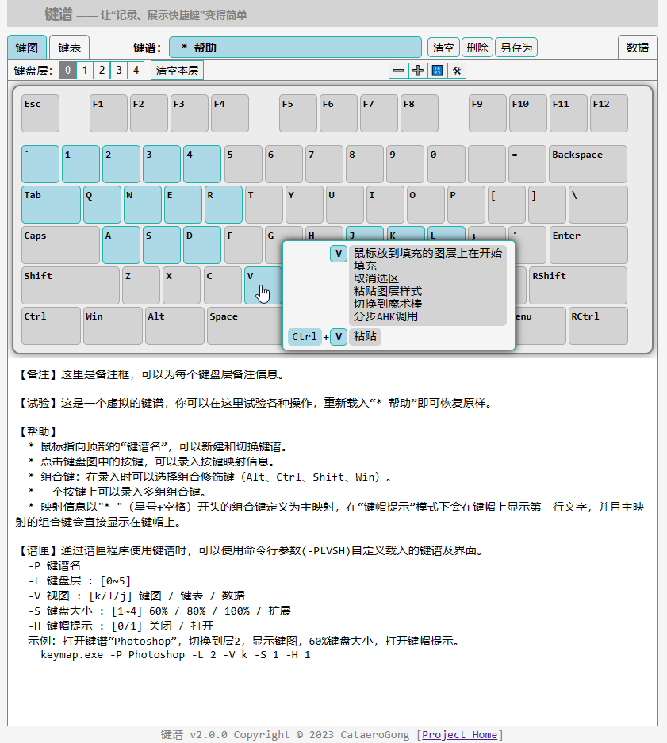

# 键谱 keymap

一个录入、展示按键映射信息的单网页应用。

## 特点

* 支持组合键
* 信息录入方便
* 图形化展示（多种模式）
* 支持多个键盘映射配置
* 数据存放在浏览器本地
* 支持导入导出
* 单网页文件，浏览器直接打开，无需联网，无需自建 web 服务

## Screenshot

# [谱匣 - “键谱”网页的辅助增强程序](exe\README.md)

## 功能

* 让“键谱”像一个独立的单机程序一样运行（其实还是需要系统的浏览器）

* 为“键谱”增加文件存储能力，键盘映射配置会存储在同目录下的同名文件里

* 支持命令行参数(-PLVSH)自定义载入的键谱及显示界面
